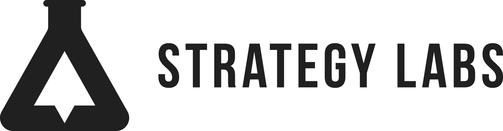

  <picture>
    <source media="(prefers-color-scheme: dark)" srcset="assets/SL-Logo-Horizontal-White.png">
    
  </picture>

# Strategy Labs — Resources

Shared, hand-editable team resources. Each subfolder is self-contained.

| Resource | What it is |
|---|---|
| [command-center/](command-center/) | A simplified inbox workspace for Cowork — triage Gmail/Slack, daily brief over Calendar, optional ClickUp. Native connectors, nothing to install. |

## Using a resource

Most resources are Cowork workspaces. To use one: copy its folder into a working location
(e.g. `~/Documents/Claude/Projects/`), open a chat pointed at that folder, and follow its README.
